# S-DES
## 作业报告
#### 1.基本测试
在本关卡中，我们一共进行了三组测试，明文加密后得到密文，密文解密后又得到了相同的明文，该关卡测试通过，以下是测试截图。

第一组加密：

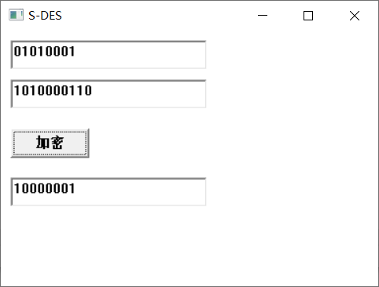

第一组解密：

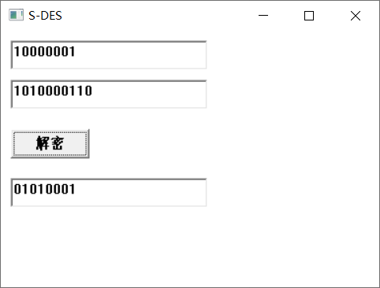

第二组加密：

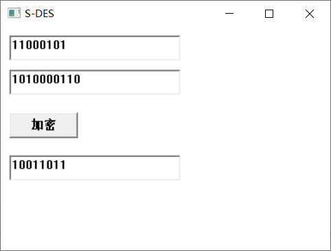

第二组解密：


第三组加密：

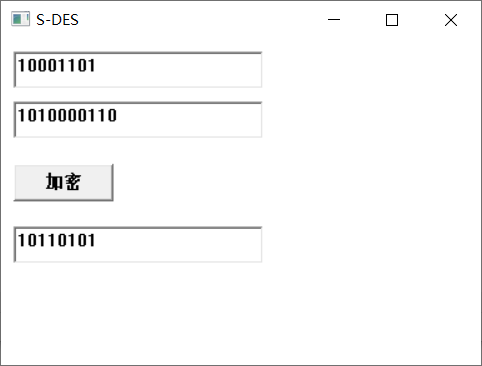

第三组解密：

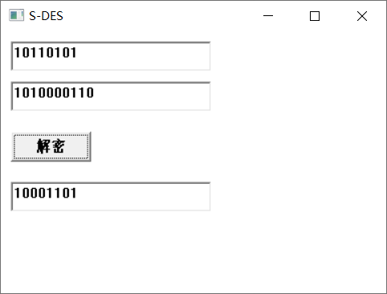

#### 2.交叉测试
在本关卡中，本组与对照组都采用相同的明文和密钥来进行加密操作，观察生成的密文是否相同，效果如下。

本组加密：

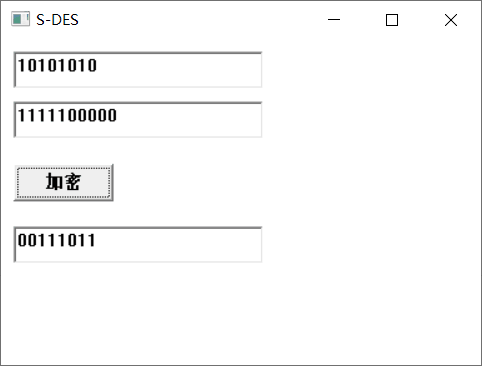

对照组加密：

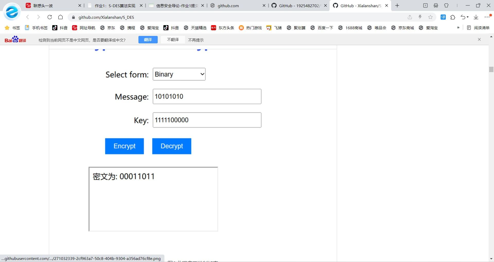

如上图所示，结果有些许差异。

#### 3.扩展功能
在本关卡中，我们输入一个ASCⅡ码字符，然后对其进行加密，将得到的密文再进行解密，得到了输入的ASCⅡ码，本关卡成功，效果如下图。

加密：


解密：

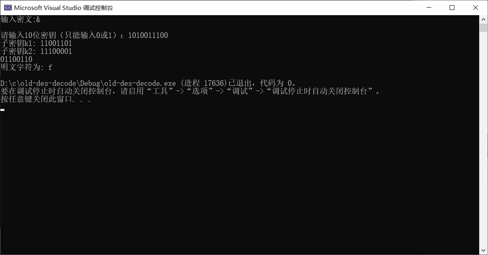

#### 4.暴力破解
我们通过输入三组明密文对，来进行暴力破解，该关卡成功通关，以下是效果图：

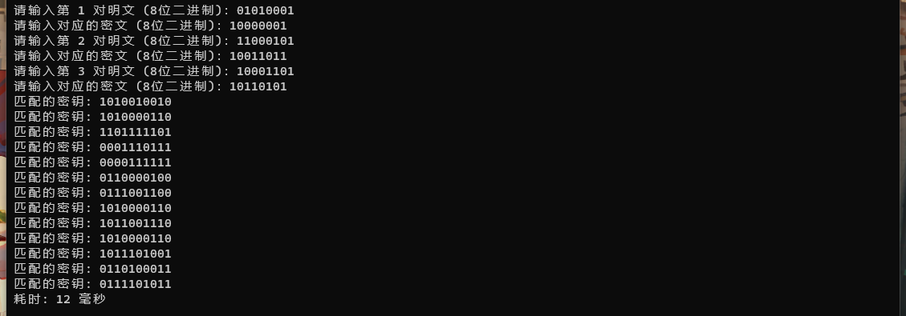

#### 5.封闭测试
根据第四关的结果，我们不难发现，对于随机选择的明密文对，有不止一个key。

因此，我们又通过对一个选定的明文01010001，我们用可用的所有10bit密钥（共1024个）对其进行加密，并统计所出现的重复密文以及重复次数，结果如下图：

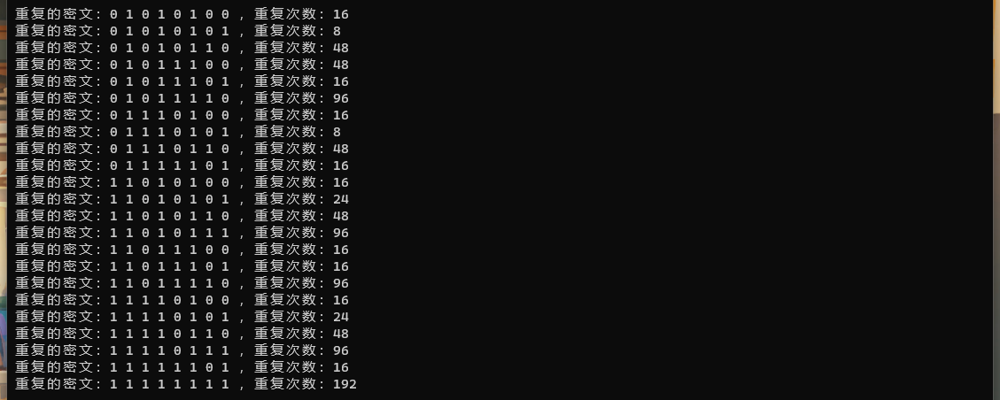

## 开发手册
#### 1.密钥扩展置设计
```
// P10置换表
int P10[] = { 3, 5, 2, 7, 4, 10, 1, 9, 8, 6 };

// P8置换表
int P8[] = { 6, 3, 7, 4, 8, 5, 10, 9 };

// 左移位数
int left_shift1[] = { 1, 1 };
int left_shift2[] = { 2, 2 };

// 左循环移位函数
bitset<5> leftCircularShift(const bitset<5>& bits, int shift) {
    bitset<5> shifted_bits;
    for (int i = 0; i < 5; i++) {
        int new_pos = (i + shift) % 5;
        shifted_bits[i] = bits[new_pos];
    }
    return shifted_bits;
}

// P8置换函数
bitset<8> performP8(const bitset<10>& key) {
    bitset<8> new_key;
    for (int i = 0; i < 8; i++) {
        new_key[i] = key[P8[i] - 1];
    }
    return new_key;
}
```

在主函数中调用：
```
// 将明文和密钥转换为二进制数组

int p[8];
for (int i = 0; i < 8; i++) {
    p[i] = plaintext[i] - '0';
}

bitset<10>  k;
for (int i = 0; i < 10; i++) {
    k[i] = key[P10[i] - 1] - '0';
}
//cout << k[1] << endl;
bitset<10> initial_key(k);
bitset<5> left_half = (initial_key >> 5).to_ulong();
bitset<5> right_half = (initial_key & bitset<10>("0000011111")).to_ulong();

left_half = leftCircularShift(left_half, left_shift1[0]);
right_half = leftCircularShift(right_half, left_shift1[1]);
bitset<10> key1 = (left_half.to_ulong() << 5) | right_half.to_ulong();
bitset<8> subkey1 = performP8(key1);

left_half = leftCircularShift(left_half, left_shift2[0]);
right_half = leftCircularShift(right_half, left_shift2[1]);
bitset<10> key2 = (left_half.to_ulong() << 5) | right_half.to_ulong();
bitset<8> subkey2 = performP8(key2);

int k1[8];
for (int i = 0; i < 8; i++) {
    k1[i] = subkey1[i];
}

int k2[8];
for (int i = 0; i < 8; i++) {
    k2[i] = subkey2[i];
}
```

通过以上方式获得子密钥k1、k2

#### 2.初始置换盒、最终置换盒、轮函数设计
```
void replace_start(int p[], int c1[])//初始置换
{

    int rs[8] = { 2,6,3,1,4,8,5,7 };//初始置换盒
    for (int i = 0; i < 8; i++)
    {
        c1[i] = p[rs[i] - 1];
    }
}

void replace_end(int c[], int p1[])//最终置换
{

    int re[8] = { 4,1,3,5,7,2,8,6 };//最终置换盒
    for (int i = 0; i < 8; i++)
    {
        p1[i] = c[re[i] - 1];
    }

}

// 左移一位
void leftShift(int arr[]) {
    int temp = arr[0]; // 保存第一个元素的值

    for (int i = 0; i < 3; i++) {
        arr[i] = arr[i + 1]; // 将后一个元素的值赋给当前元素
    }

    arr[3] = temp; // 将保存的第一个元素的值赋给最后一个元素
}

// 右移一位
void rightShift(int arr[]) {
    int temp = arr[3]; // 保存最后一个元素的值

    for (int i = 3; i > 0; i--) {
        arr[i] = arr[i - 1]; // 将前一个元素的值赋给当前元素
    }

    arr[0] = temp; // 将保存的最后一个元素的值赋给第一个元素
}
int bitOr(int a, int b) {//相或
    return (a ^ b); // 使用按位或运算符实现
}
void x_y(int a, int b, int& c)//s盒依据拓展的特定位数判断盒中的横纵
{
    if (a == 1 && b == 1)
    {
        c = 3;
    }
    else if (a == 1 && b == 0)
    {
        c = 2;
    }
    else if (a == 0 && b == 1)
    {
        c = 1;
    }
    else if (a == 0 && b == 0)
    {
        c = 0;
    }
}
void tr(int a, int& b, int& c)// 依据s盒中数据给出01值
{
    if (a == 0)
    {
        b = 0; c = 0;
    }
    else if (a == 1)
    {
        b = 0; c = 1;
    }
    else if (a == 2)
    {
        b = 1; c = 0;
    }
    else if (a == 3)
    {
        b = 1; c = 1;
    }
}

void fk(int ip[], int k[], int f[])//轮函数fk
{
    //int left[4];
    int right[4];//取出右半数组
    //for (int i = 0; i < 4; i++)
    //{
        //left[i] = ip[i];
   // }
    for (int i = 4; i < 8; i++)
    {
        right[i - 4] = ip[i];
    }
    int right_e[8];
    rightShift(right);
    for (int i = 0; i < 4; i++)
    {
        right_e[i] = right[i];
    }
    leftShift(right);
    leftShift(right);
    for (int i = 4; i < 8; i++)
    {
        right_e[i] = right[i - 4];
    }//拓展置换
    //相或
    for (int i = 0; i < 8; i++)
    {
        right_e[i] = bitOr(right_e[i], k[i]);
    }
    int s1[4][4] = { {1,0,3,2},
                     {3,2,1,0},
                     {0,2,1,3},
                     {3,1,0,2} };
    int s2[4][4] = { {0,1,2,3},
                     {2,3,1,0},
                     {3,0,1,2},
                     {2,1,0,3} };//定义s盒1和2
    int x, y;
    x_y(right_e[0], right_e[3], x);
    x_y(right_e[1], right_e[2], y);
    //cout << right_e[0] <<"   "<< right_e[3] << endl;
    //cout << 10 << endl;
    int S[4];//一个用来存储s盒改变完后的数组 
    tr(s1[x][y], a, b);
    S[0] = a;
    S[1] = b;
    x_y(right_e[4], right_e[7], x);
    x_y(right_e[5], right_e[6], y);
    tr(s2[x][y], a, b);
    S[2] = a;
    S[3] = b;
    int sp[4] = { 2,4,3,1 };
    //最终出现的轮函数F
    for (int i = 0; i < 4; i++)
    {
        f[i] = S[sp[i] - 1];
    }

}
void rearr(int f[], int ip[])//pi左半与F进行或操作
{
    for (int i = 0; i < 4; i++)
    {
        ip[i] = bitOr(f[i], ip[i]);
    }
}
void exchange(int ip[])//数组交换左右部分
{
    for (int i = 0; i < 4; i++) {
        int temp = ip[i]; // 保存左半部分的元素
        ip[i] = ip[i + 4]; // 将右半部分的元素复制到左半部分
        ip[i + 4] = temp; // 将左半部分的元素复制到右半部分
    }
}
```

在主函数中调用：
```
int ip[8];//中间存储数组
replace_start(p, ip);
int f[4];//F
fk(ip, k1, f);
rearr(f, ip);
exchange(ip);
fk(ip, k2, f);
rearr(f, ip);
int c[8];//最终密文
replace_end(ip, c);
// 将密文转换为字符串
char ciphertext[9];
for (int i = 0; i < 8; i++) {
    ciphertext[i] = c[i] + '0';
}
ciphertext[8] = '\0';
```

通过以上方式，将输入的明文，结合之前得到子密钥k1、k2，即可获得密文ciphertext。

采用以上设计，将k1与k2的使用位置对换（即将fk(ip, k1, f)与fk(ip, k2, f)这两行代码的位置对换），即可完成密文解密为明文。

#### 3.扩展功能实现
输入字符转换为8位2进制：
```
cin >> str1;
    if (str1.length() == 1) {//输入一个字符转换8bit数据 
        char ch = str1[0];
        bitset<8> binary(ch);  // 将字符 ch 转换为 8 位二进制数
        for (int i = 0; i < 8; ++i) {
            p[i] = binary[i];   // 将二进制数按位存入数组
        }
        int start = 0;
        int end = 7;

        while (start < end) {
            // 交换数组元素
            int temp = p[start];
            p[start] = p[end];
            p[end] = temp;

            // 更新指针
            start++;
            end--;
        }//因为其倒置了，所以要置换回去
    }
    else {//检测为8位及不是输入字符，就如此输入
        for (int i = 0; i < 8; i++) {
            p[i] = str1[i] - 48;
        }
    }
```

输出字符类型：
```
 if (str1.length() == 1)
    {
        string binaryStr;
        for (int i = 0; i < 8; i++) {
            binaryStr += to_string(c[i]);
        }//转换为string类型

        for (int i = 0; i < 8; i++)
        {
            cout << c[i];
        }
        cout << endl;
        int num = stoi(binaryStr, nullptr, 2); //先转换为整数

        // 将整数转换为对应的字符
        char ch = static_cast<char>(num);
        cout << "密文字符为: " << ch << endl;
    }
    else
    {
        for (int i = 0; i < 8; i++)
        {
            cout << c[i];
        }
    }
```

#### 4.暴力破解实现
输入明密文对：
```
string plaintexts[3];  // 存储明文
string ciphertexts[3]; // 存储密文

for (int i = 0; i < 3; i++) {
    cout << "请输入第 " << i + 1 << " 对明文 (8位二进制)：";
    cin >> plaintexts[i];
    cout << "请输入对应的密文 (8位二进制)：";
    cin >> ciphertexts[i];
}
```

设置时间戳记录破解时间：
```
// 记录开始时间
auto start_time = high_resolution_clock::now();

// 记录结束时间
auto end_time = high_resolution_clock::now();

// 计算耗时（以毫秒为单位）
auto duration = duration_cast<milliseconds>(end_time - start_time);
```

尝试所有可能的key，如果加密后的密文与输入的密文匹配，将其输出：
```
for (int key = 0; key < 1024; key++)

// 逐一比较密文和c1
bool match = true;
for (int j = 0; j < 8; j++) {
    if (c[j] != c1[j]) {
        match = false;
        break;
    }
}

// 如果匹配，打印密钥
if (match) {
    std::bitset<10> binary(key);
    cout << "匹配的密钥: ";
    for (int j = 0; j < 10; j++) {
        cout << binary[j];
    }
    cout << endl;
}
```

#### 5.封闭测试实现
下列代码查找重复密文：
```
int p[8];
    string input_key_str;
    
    //string str1;
    vector<vector<int>> cm;
       vector<string> binaryArrays;

        // 遍历所有可能的情况
        for (int i = 0; i < 1024; i++) {
            string binaryArray;

            // 将整数转换为二进制字符串
            for (int j = 9; j >= 0; j--) {
                binaryArray += to_string((i >> j) & 1);
            }

            binaryArrays.push_back(binaryArray);
        }//找到所有10位密文的情况
        int p0[3][8] = { {0,1,0,1,0,0,0,1},
               {1,1,0,0,0,1,0,1},
               {1,0,0,0,1,1,0,1}};//要查找多个密文的示例3个明文
       for (int i = 0; i < 3; i++)//对所有3个示例明文循环查找
       {
           for (int j = 0; j < 1024; j++) {//用每个密钥进行加密

 map<vector<int>, int> countMap;
       for (const auto& array : cm) {
           countMap[array]++;//利用其找到重复的密文
       }

       // 输出重复的数组以及它们的重复次数
       for (const auto& pair : countMap) {
           if (pair.second > 1) {
               cout << "重复的密文：";
               for (const auto& element : pair.first) {
                   cout << element << " ";
               }
              cout << "，重复次数：" << pair.second << endl;
           }
       }
```

#### 6.GUI设计
创建GUI窗口：
```
int main(HINSTANCE hInstance, HINSTANCE hPrevInstance, PWSTR pCmdLine, int nCmdShow) {
    const wchar_t CLASS_NAME[] = L"SDESWindowClass";

    WNDCLASS wc = {};

    wc.lpfnWndProc = WindowProc;
    wc.hInstance = hInstance;
    wc.lpszClassName = CLASS_NAME;

    RegisterClass(&wc);

    HWND hWnd = CreateWindowEx(0, CLASS_NAME, L"S-DES", WS_OVERLAPPEDWINDOW, CW_USEDEFAULT, CW_USEDEFAULT, 400, 300, nullptr, nullptr, hInstance, nullptr);
    if (hWnd == nullptr) {
        return 0;
    }

    // 创建输入明文的编辑框
    hWndEditInputPlaintext = CreateWindowEx(WS_EX_CLIENTEDGE, L"EDIT", L"", WS_CHILD | WS_VISIBLE | ES_AUTOHSCROLL, 10, 10, 200, 30, hWnd, (HMENU)EDIT_INPUT_PLAINTEXT_ID, nullptr, nullptr);
    if (hWndEditInputPlaintext == nullptr) {
        return 0;
    }

    // 创建输入密钥的编辑框
    hWndEditInputKey = CreateWindowEx(WS_EX_CLIENTEDGE, L"EDIT", L"", WS_CHILD | WS_VISIBLE | ES_AUTOHSCROLL, 10, 50, 200, 30, hWnd, (HMENU)EDIT_INPUT_KEY_ID, nullptr, nullptr);
    if (hWndEditInputKey == nullptr) {
        return 0;
    }

    // 创建按钮
    hWndButton = CreateWindow(L"BUTTON", L"加密", WS_CHILD | WS_VISIBLE, 10, 100, 80, 30, hWnd, (HMENU)BUTTON_ID, nullptr, nullptr);
    if (hWndButton == nullptr) {
        return 0;
    }

    // 创建输出密文的编辑框
    hWndEditOutputCiphertext = CreateWindowEx(WS_EX_CLIENTEDGE, L"EDIT", L"", WS_CHILD | WS_VISIBLE | ES_READONLY | ES_AUTOHSCROLL, 10, 150, 200, 30, hWnd, (HMENU)EDIT_OUTPUT_CIPHERTEXT_ID, nullptr, nullptr);
    if (hWndEditOutputCiphertext == nullptr) {
        return 0;
    }

    ShowWindow(hWnd, nCmdShow);

    MSG msg = {};
    while (GetMessage(&msg, nullptr, 0, 0)) {
        TranslateMessage(&msg);
        DispatchMessage(&msg);
    }

    return 0;
}
```

当用户通过GUI进行操作时的反馈：
```
LRESULT CALLBACK WindowProc(HWND hwnd, UINT uMsg, WPARAM wParam, LPARAM lParam) {
    switch (uMsg) {
    case WM_COMMAND:
        if (HIWORD(wParam) == BN_CLICKED) {
            if ((HWND)lParam == hWndButton) {

                // 加解密操作

                // 将密文输出到控件
                SetWindowTextA(hWndEditOutputCiphertext, ciphertext);
            }
        }
        break;
    case WM_CLOSE:
        DestroyWindow(hwnd);
        break;
    case WM_DESTROY:
        PostQuitMessage(0);
        break;
    default:
        return DefWindowProc(hwnd, uMsg, wParam, lParam);
    }

    return 0;
}
```

## 用户指南
#### 简介：
DES（Data Encryption Standard）是一种对称加密算法，它是最早也是最广泛使用的加密标准之一。DES算法适用于对长度为64位的数据块进行加密和解密，使用一个8位的密钥。
DES算法的核心是轮函数和密钥扩展。它采用了分组密码和迭代加密的设计思想，具有较高的安全性和可靠性。

下面是DES算法的简要步骤：

1.密钥生成：从8位输入密钥中经过置换、分割和压缩等操作，生成2个4位的子密钥，用于后续的加密和解密过程。

2.初始置换：将输入的10位明文按照固定的规则进行重新排列和调整，生成初始置换结果。

3.轮函数：DES算法使用2轮迭代加密的方式。每轮的输入包括32位的左半部分和右半部分。右半部分经过扩展运算，与子密钥进行异或运算，然后通过S-盒替换和P-盒置换得到新的右半部分。最后与左半部分进行异或运算得到新的5位输入。

4.轮函数迭代：重复进行2轮轮函数操作。

5.逆初始置换：经过2轮迭代后，将最后的5位左半部分和右半部分交换位置。

6.输出密文：经过逆初始置换后，得到10位的密文输出。

#### 操作流程：
1.打开DES加密/解密程序界面。


2.在第一行输入框中，输入8位的明文。确保明文只包含0和1。

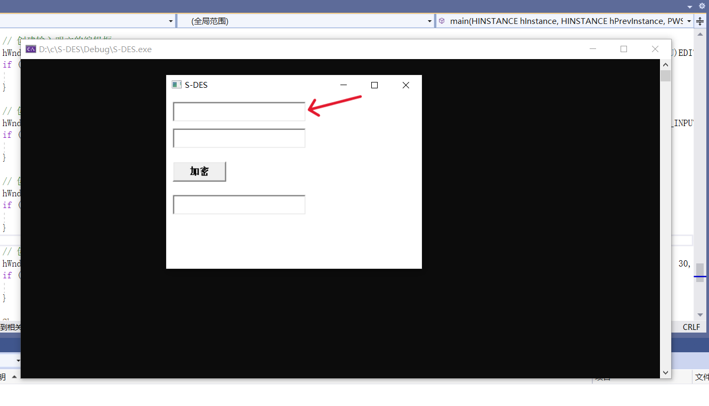

3.在第二行输入框中，输入10位的密钥。同样确保密钥只包含0和1。


4.点击"加密"按钮，程序将会使用DES算法对明文进行加密。

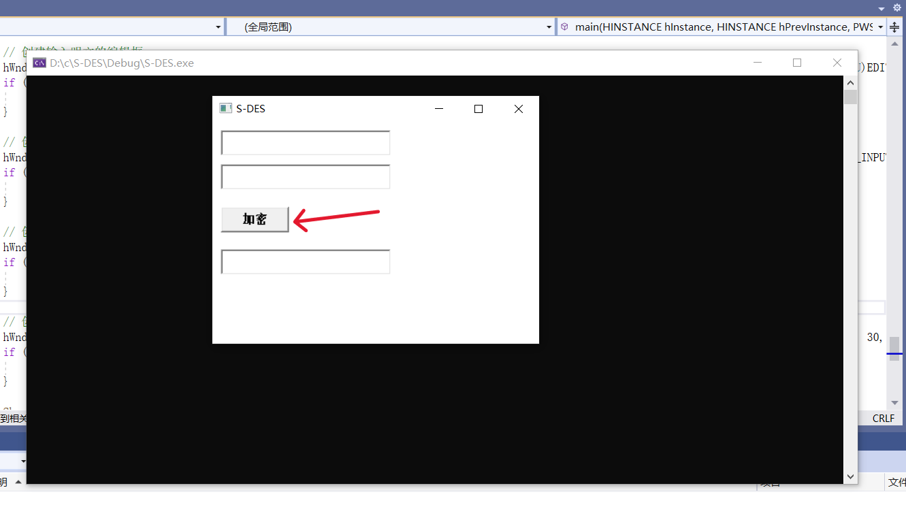

5.在下方的输入框中，将显示出加密后的8位密文。请复制或记下该密文以备解密操作使用。

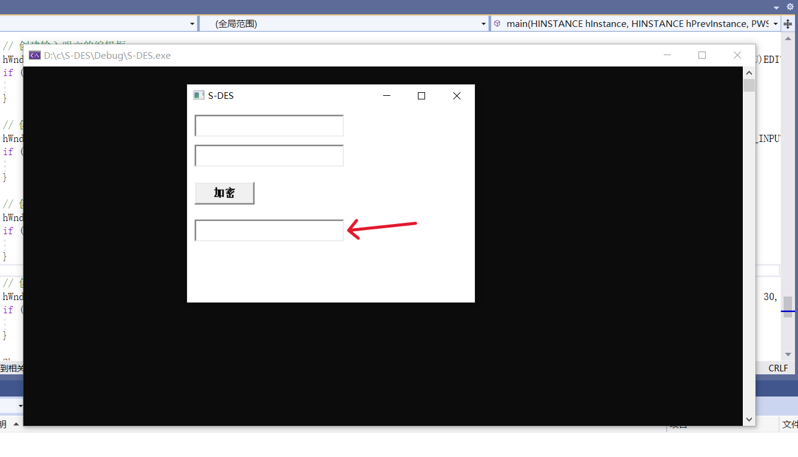

例如下：


解密过程：

1.在第一行输入框中，输入要解密的8位密文。确保密文只包含0和1。

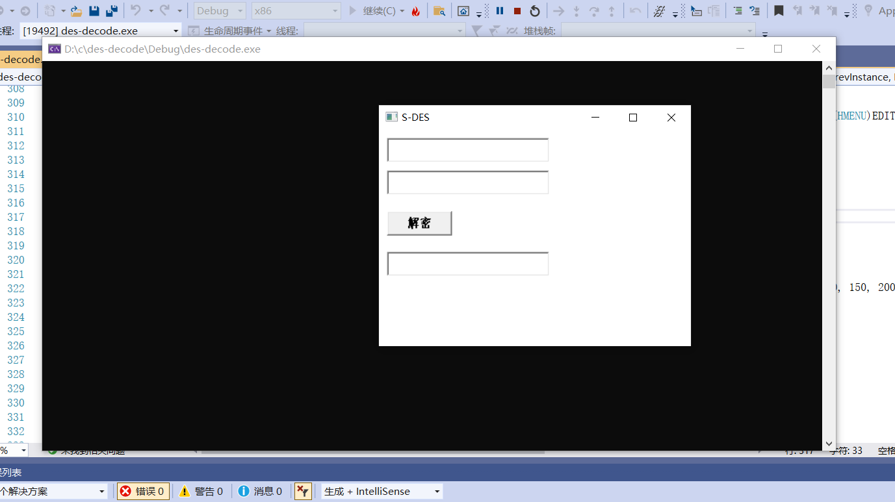

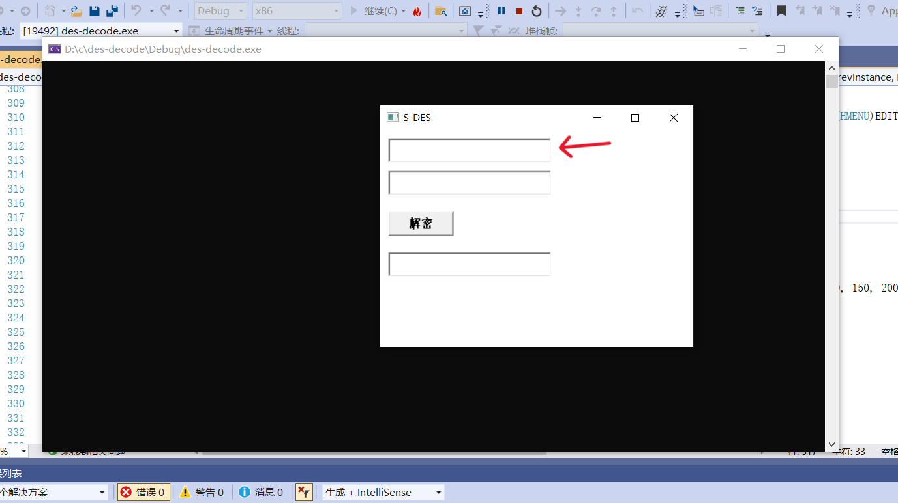

2.在第二行输入框中，输入之前用于加密的10位密钥。

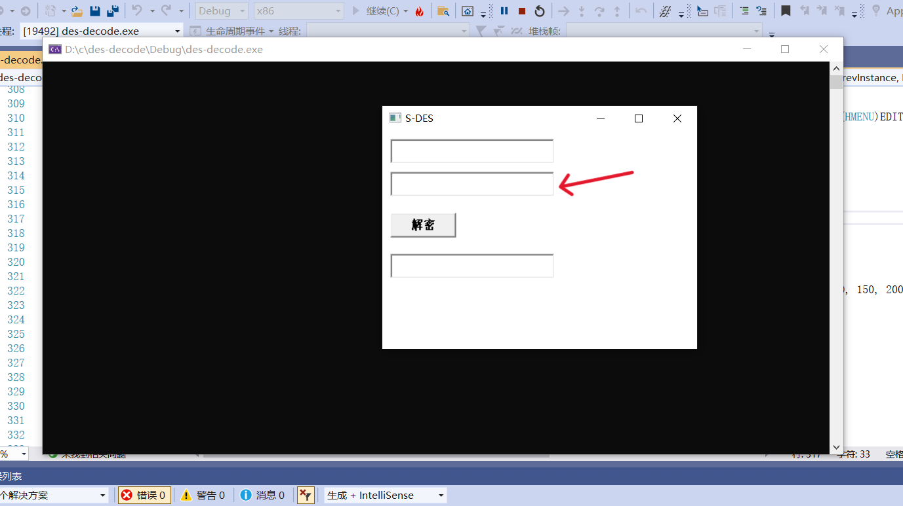

3.点击"解密"按钮，程序将会使用DES算法对密文进行解密。


4.在下方的输入框中，将显示出解密后的明文。


解密界面：


#### 注意事项：
请注意，加密和解密操作使用的是相同的密钥。确保在解密操作中使用与加密操作相匹配的密钥。

另外，DES算法存在一些安全性问题，例如密钥长度较短，易受到暴力破解等攻击。因此，在实际应用中，DES算法已经逐渐被更为安全和高效的加密算法如AES所取代。

#### 联系作者：
QQ：1322877041  QQ：3230506757
